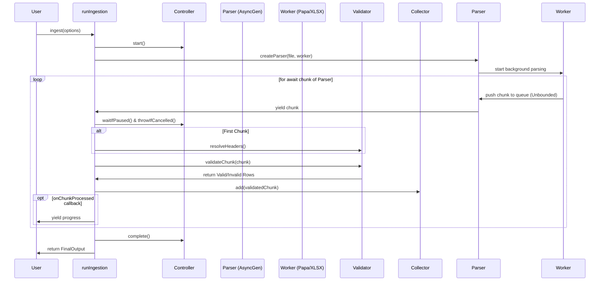

# IngestX Ingestion Flow Audit

## 1. Executive Summary

The current architecture of IngestX implements a generic ingestion pipeline supporting both CSV and Excel files, running validation, and assembling results. The overall structure is sound and clearly segmented.

However, the architecture currently falls short of its target to support 500MB+ files without freezing the UI. There are critical (P0) flaws related to memory explosion in the Excel parser, missing backpressure in all parsers, and a lack of cancellation propagation that results in memory leaks when tasks are cancelled or paused.

**The project is NOT ready to move forward.** The core streaming and lifecycle (pause/cancel) architecture must be corrected before adding new features.

## 2. Repository Architecture

The core of the ingestion pipeline resides in `src/core`:

```text
src/core/
├── index.ts                 (Public exports)
├── controller/              (Pause/Resume/Cancel state)
├── errors/                  (Custom error types)
├── headers/                 (Header resolution/matching)
├── ingest/
│   ├── index.ts             (Pipeline entry point, runIngestion)
│   ├── OutputCollector.ts   (Result assembly)
│   └── types.ts
├── parser/
│   ├── CsvParser/           (PapaParse wrapper)
│   ├── ExcelParser/         (XLSX worker wrapper)
│   ├── createParser.ts      (Factory)
│   └── types.ts
└── validator/               (Row/Chunk validation and rule execution)
```

## 3. Actual Runtime Flow

### High-level flow

```mermaid
flowchart TD
    A[Public ingest API] --> B[Controller State]
    B --> C[Parser Factory]
    C --> D[Async Generator / Queue]
    D --> E[Chunk Processor]
    E --> F[Header Resolver (1st chunk only)]
    E --> G[Validator]
    G --> H[Output Collector]
    H --> I[Final Output]
```

### Detailed ingestion sequence



### Data flow

- **File:** Handed to `CsvParser` or `ExcelParser`.
- **Worker:** Parses file and sends objects to `queue` in the main thread parser wrapper.
- **Chunks:** Emitted as `RowsAndHeaders` from the async generator queue.
- **Validation Results:** Each row is mapped to `RowValidationResult`.
- **Final Output:** Aggregated in `OutputCollector`. Stores copies of rows if `collectResults: true`.

## 4. Actual vs Intended Architecture

| Feature                | Intended Architecture                   | Actual Implementation                                                                 |
| :--------------------- | :-------------------------------------- | :------------------------------------------------------------------------------------ |
| **Worker execution**   | Parse and validate in background thread | **Only Parsing** is in background. Validation runs in main thread.                    |
| **Streaming (500MB+)** | Low memory footprint by chunking        | **Fails**. Excel loads entire file to memory. Queues are unbounded (no backpressure). |
| **Cancellation**       | Stops all work and frees memory         | **Fails**. Throws in main loop, but workers keep parsing and filling memory.          |
| **Pause/Resume**       | Halts processing temporarily            | **Fails**. Main thread halts, but parsers keep parsing and queuing chunks infinitely. |

## 5. Findings

### P0 — Blocking

1.  **Excel Worker Memory Explosion:**
    - **Location:** `ExcelParser/excel.worker.ts`
    - **Problem:** The worker loads the entire file via `arrayBuffer()`, parses it entirely into a workbook, and converts the whole sheet to a JSON array using `sheet_to_json` BEFORE creating chunks.
    - **Why it matters:** A 500MB+ Excel file will instantly crash the browser with OOM errors. It defeats the purpose of chunking entirely.
2.  **No Cancellation Propagation:**
    - **Location:** `IngestionController.ts`, `CsvParser`, `ExcelParser`, `runIngestion`
    - **Problem:** `Controller.cancel()` throws an error in the main thread iteration loop, but there is no mechanism to signal the underlying parser (or worker) to stop.
    - **Why it matters:** The worker continues reading the file and pumping chunks into the main thread's `queue` array, causing severe memory leaks.
3.  **Unbounded Queues (No Backpressure):**
    - **Location:** `CsvParser/index.ts`, `ExcelParser/index.ts`
    - **Problem:** The parser wrappers push chunks into a `queue` array as fast as the worker emits them. The main thread pulls from this queue using `for await`. If validation is slower than parsing (or if the user clicks "Pause"), the queue grows infinitely.
    - **Why it matters:** It will cause memory growth scaling linearly with file size.

### P1 — Major

1.  **Assembly Memory Leak on `collectResults`:**
    - **Location:** `OutputCollector.ts`
    - **Problem:** When `collectResults` is `true`, every single row is kept in memory (`validRows` and `invalidRows` arrays).
    - **Why it matters:** For 500MB+ files, users should rely on `onChunkProcessed` and not `collectResults`. If they set `collectResults: true`, the library will crash the browser.

### P2 — Important

1.  **Errors report transformed values instead of original values:**
    - **Location:** `validateRow.ts`, `OutputCollector.ts`
    - **Problem:** `OutputCollector` pulls `receivedValue` from `invalid.data[columnKey]`. However, `invalid.data` has already been populated with transformed/default values in `validateRow`.
    - **Why it matters:** The error report tells the user their value was invalid, but shows them a transformed value they never entered.

### P3 — Minor

1.  **Main Thread Validation:** Validation runs in the main thread (`validateChunk` inside `runIngestion`). While not strictly a bug, for 500MB files, complex regex validation will freeze the main thread despite parsing being in a worker.
2.  **Empty File Handling:** Empty files might result in empty header sets causing weird header mismatch errors.

## 6. Missing Links

1.  **Controller → Parser Cancellation/Pause:** The controller manages pause/cancel state, but does not pass an abort signal or pause signal to the parsers.
2.  **AsyncGenerator → Worker cleanup:** The `for await` loop in `runIngestion` can break (due to header mismatch or cancellation), but the async generator does not implement a `.return()` method to terminate the worker when the consumer stops consuming.

## 7. Memory / Performance Analysis

- **Current Memory Model:** The architecture behaves as if it streams, but the lack of backpressure forces the entire file into memory (in the `queue` array) if parsing is faster than validation.
- **Excel Specifics:** The memory model for Excel is completely non-streaming. The file is duplicated 3 times in memory (ArrayBuffer -> Workbook -> JSON Array) before chunks are even yielded.
- **Likely Bottlenecks:** Main thread validation of chunks will cause UI stutter if `chunkSize` (default 10000) takes too long to validate synchronously.

## 8. Test Coverage Gaps

| Component        | Unit Tests | Integration Tests | Edge Cases | Performance |
| :--------------- | :--------- | :---------------- | :--------- | :---------- |
| CSV Parser       | Missing    | Missing           | Missing    | Missing     |
| Excel Parser     | Missing    | Missing           | Missing    | Missing     |
| Worker           | Missing    | Missing           | Missing    | Missing     |
| Validator        | Missing    | Missing           | Missing    | Missing     |
| Chunk Processing | Missing    | Missing           | Missing    | Missing     |
| Assembly         | Missing    | Missing           | Missing    | Missing     |
| Full Ingestion   | Missing    | Missing           | Missing    | Missing     |

**Critical Edge Cases Missing:**

- Large file processing (memory profiling tests).
- Cancellation during midway chunk processing.
- Pause/resume backpressure tests.

## 9. Recommended Fix Order

1.  **Fix Parser Interfaces:** Add an `abort()` or `destroy()` method to `Parser` interface. Implement `AbortController` in `CsvParser` (using PapaParse's `abort`) and `ExcelParser` (using `worker.terminate()`).
2.  **Fix Cancellation Propagation:** Update `runIngestion` to call `parser.abort()` when an error or cancellation happens.
3.  **Fix Backpressure:** Modify the parsers to wait for the consumer before pulling more data. For Excel, this requires chunking logic inside the worker that pauses until the main thread requests more. For PapaParse, use the `pause()` and `resume()` API inside the chunk callback.
4.  **Fix Excel Memory:** Replace `sheet_to_json` with a streaming row-by-row reader using XLSX utility functions (e.g. `sheet_to_json` with ranges or iterating over sheet cells directly in chunks), preventing the whole sheet from loading into a massive array.
5.  **Address Output Collector:** Clearly document or warn when `collectResults: true` is used with large files, or introduce an upper bound limit for rows stored in memory.

## 10. Final Readiness Assessment

Architecture: 5/10 (Good separation, but flawed lifecycle)
Correctness: 6/10 (Validation logic is sound, but error mapping is slightly off)
Large-file readiness: 1/10 (Will crash due to missing backpressure and Excel parsing strategy)
Worker readiness: 4/10 (Only partially implemented, missing validation in worker)
Test readiness: 0/10 (Missing critical test suites)
API readiness: 7/10 (Clean public interface)

Overall: 3.8/10

**DO NOT MOVE FORWARD YET**

**Blockers:**

- Excel file memory explosion
- Unbounded parser queues
- Cancellation memory leaks

## 11. Final Architecture Diagram (Post Fix #3 & #4)

```mermaid
flowchart TD
    Main[Main Thread]
    Worker[Excel Worker]

    Main -- REQUEST_CHUNK --> Worker

    subgraph Excel Worker Process
        Worker -- XLSX parsing --> XLSX[Workbook parsed into memory]
        XLSX -- bounded row extraction --> Rows[Extract next chunk]
        Rows -- chunk construction --> Chunk[Construct bounded chunk]
    end

    Chunk -- postMessage(chunk) --> Main

    subgraph Main Thread Validation
        Main -- validation --> Val[Validate chunk]
        Val -- next demand --> Main
    end

    Cancel[cancel()] -. terminates worker .-> Worker
```

## 12. Fix #5: OutputCollector Memory Model (COMPLETED)

**Status:** Completed
**Problem:** `OutputCollector` was silently accumulating rows when `collectResults=true`, causing potential browser OOMs for large files, making its behavior unpredictable.

### Current Collector Behavior

The collector behavior is now explicit and configurable.

- **`collectResults: false` (Streaming Mode):**
  Memory remains strictly bounded. The collector only maintains counts (`totalRows`, `validRowsCount`, `invalidRowsCount`). Valid and invalid row arrays remain completely empty, guaranteeing no memory leakage.

- **`collectResults: true` (Collection Mode):**
  Memory grows intentionally as O(N). Every valid and invalid row is retained in `validRows` and `invalidRows` arrays.

### Safety Limit

An optional `maxCollectedRows?: number` has been added to `IngestOptions`.

- If set, the collector enforces this as a hard upper bound _before_ retaining any row.
- If the limit is exceeded, an `Error` is thrown immediately, aborting the ingestion completely to protect the browser's memory.

### Memory Model Diagram

```text
Streaming mode (collectResults: false):

Parser
  ↓
Chunk
  ↓
Validation
  ↓
Counts / metadata
  ↓
Chunk released (Bounded Memory)


Collection mode (collectResults: true):

Parser
  ↓
Chunk
  ↓
Validation
  ↓
OutputCollector
  ↓
validRows[] / invalidRows[]
  ↓
Retained until FinalOutput (O(N) Memory)
```
